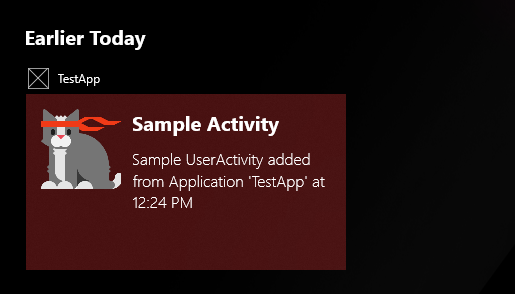

# User Activities

The User Activity feature builds upon [Deep Linking](./deep-linking.md) for activation.

The feature allows your app to include new entries to the user's activity feed. For more information about User Activities see [Microsoft Docs](https://docs.microsoft.com/windows/uwp/launch-resume/useractivities).

## Understanding the code

The User Activity feature will add a sample activity on application startup created in the `UserActivityService.Sample.cs` class. It will show on your timeline like this:

The sample activity will update each time you open the application as it always uses the same ActivityId. If you need to create different activities you can do this by providing different ActivityIds. You can find more information about user activity best practices [here](https://docs.microsoft.com/windows/uwp/launch-resume/useractivities-best-practices).

The `UserActivityService.cs` class allows you to create a user activity using the method `CreateUserActivityAsync`. We've created two overloads, one allows you to specify an Adaptive Card, the other one will show a basic user activity based on title, description and background color specified in `UserActivationData`.

View more information about Adaptive Cards on [Microsoft Docs](https://docs.microsoft.com/adaptive-cards/get-started/windows) and [adaptivecards.io](http://adaptivecards.io/).
When you click on an user activity your application will activate using [Deep Linking](./deep-linking.md).
