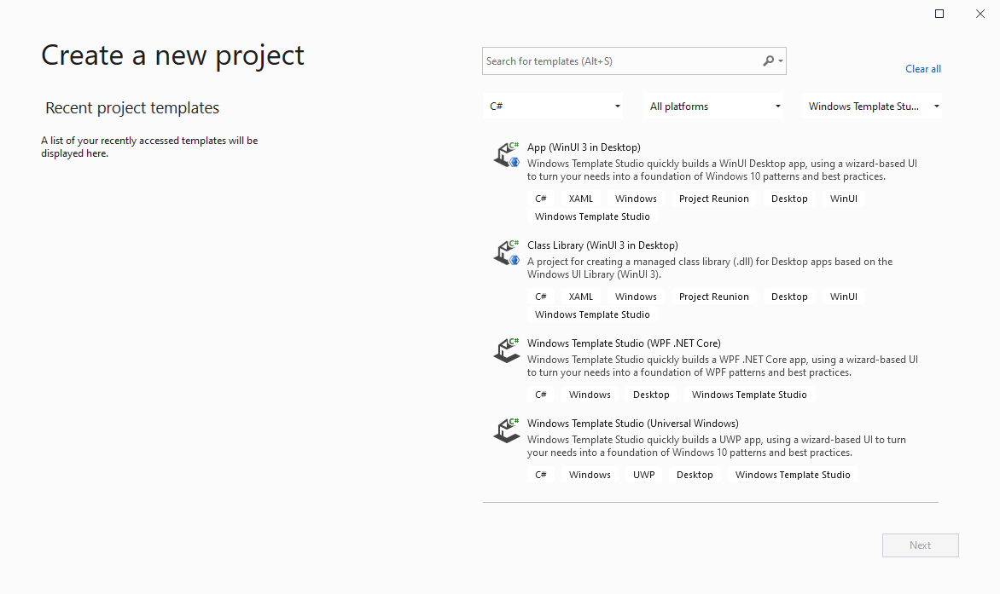

# Installing / Using the extension

## Installing the Visual Studio Extension

### Prerequisites

Windows Template Studio (WinTS) installs into your existing Windows 10 app development environment. If you're missing any of the below, you can get everything from the [Windows Dev Center Download page](https://developer.microsoft.com/en-us/windows/downloads).

- Visual Studio 2017 Update 3 or higher (any edition) or Visual Studio 2019 - Although VS 2017.3 is the minimum version, we recommend using WinTS with the latest Visual Studio Update.
- Windows 10, version 1803 (version 10.0.17134.0) or later
- .Net Framework 4.7
- Windows Template Studio extension.  You have two ways of aquiring the extension.
  - Inside Visual Studio. Select Tools→ Extensions & Updates.  Select the 'Online' node and search for Windows Template Studio then click **Download**
  - Direct link and manually install.  [Visual Studio Gallery](https://marketplace.visualstudio.com/items?itemName=WASTeamAccount.WindowsTemplateStudio)

## Public Release instructions

1. Install the Visual Studio Extension for Windows Template Studio by downloading the VSIX from the [Visual Studio Gallery](https://marketplace.visualstudio.com/items?itemName=WASTeamAccount.WindowsTemplateStudio).
2. Once installed, open Visual Studio 2017 and select File→ New Project→ C# → Windows Universal and you should see Windows Template Studio as an option.

on Visual Studio 2019 you can use the search box or the filters to get to the Windows Template Studio project template

3. To add pages and features to an existing **Windows Template Studio** project, select the project and choose Windows Template Studio → 'New page', 'New feature', 'New service', or 'New testing project' from the context menu. For more info on adding new items see [here](newitem.md).

## Nightly / Pre-release feeds for Windows Template Studio

- **Nightly:** <https://www.myget.org/F/windows-template-studio-nightly/vsix/>
- **Pre-release (stable):** <https://www.myget.org/F/windows-template-studio-prerelease/vsix/>

### Nightly / Pre-release instructions

The Pre-release build version allows you to get updates with stable features not officially released yet (so, they are not definitive and may change).  This build starts at 3AM GMT every night.

This feed will have stable extension versions so it is not thought to have breaking changes (and can be installed side by side with the official one), anyway, installing this extension is at your own risk.

Open Visual Studio 2017 and go to **Tools→ Extensions & Updates**, then click on **Change your Extensions and Updates settings** *(bottom left of the 'Extensions and Updates' window)* and create an Additional Extension Gallery. On Visual Studio 2019 you'll find Extensions on a separate **Extensions** Menu.

Then, go again to **Tools→ Extensions & Updates** and using the recently added online gallery *(added under the 'Online' node)*, download and install the Windows Template Studio extension. Note that you will likely need to restart Visual Studio for the install to complete.

Once installed, you will see a new Project Template which allows you to access to the available templates: Pre-Release version uses the VNext Template Repository.

You can start working with Windows Template Studio by cloning [our repo](https://github.com/Microsoft/WindowsTemplateStudio) and working locally with the code and the available templates.  If you plan to contribute, please follow the [contribution guidelines](../CONTRIBUTING.md)

### Nightly Dev-release

If you want to have updates from in-progress changes.  This feed will have the result of the daily dev-branch integration so expect some instability. This extension can be installed side by side with the official and pre-release, anyway, installing this extension is at your own risk.

---

## Learn more

- [Core concepts](./concepts.md)
- [Using and extending the generated app](./getting-started-endusers.md)
- [Getting started with the WinTS codebase](./getting-started-developers.md)
- [All docs](./readme.md)
